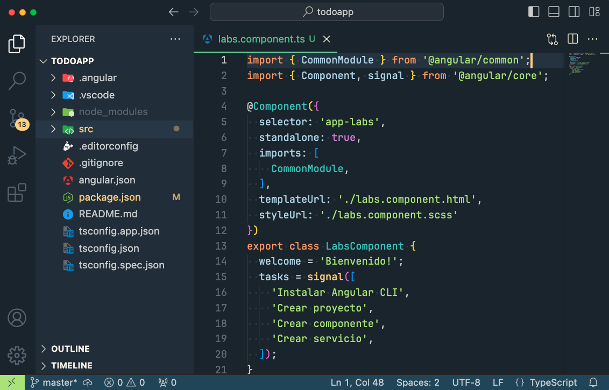

# Retrocoders Theme for VS Code

[][theme]
[][theme]

A beautiful theme designed for old-school coders.




## Best Custom Settings

### Install the font

https://fonts.google.com/specimen/Fira+Code

### Install the icon theme

https://marketplace.visualstudio.com/items?itemName=PKief.material-icon-theme

### User settings

Visual Studio Code allows you to edit the `settings.json` config file. First open the settings editor as described above, then click the "curly brackets" icon to open the `settings.json` file.

```json
{
  "workbench.startupEditor": "none",
  "workbench.iconTheme": "material-icon-theme",
  "workbench.tree.enableStickyScroll": false,
  "workbench.colorTheme": "Retrocoders",
  "files.eol": "\n",
  "[python]": {
    "editor.formatOnType": true
  },
  "terminal.integrated.fontSize": 13,
  "security.workspace.trust.untrustedFiles": "open",
  "window.zoomLevel": 1,
  "breadcrumbs.enabled": false,
  "editor.cursorStyle": "line",
  "editor.cursorWidth": 3,
  "editor.stickyScroll.enabled": false,
  "editor.fontFamily": "Fira Code, Menlo, Monaco, Courier New, monospace",
  "editor.fontLigatures": false,
  "editor.fontSize": 13,
  "editor.fontWeight": "normal",
  "editor.fontVariations": false,
  "editor.indentSize": "tabSize",
  "editor.renderWhitespace": "all",
  "editor.tabSize": 2,
  "explorer.compactFolders": false,
}
```

[theme]: https://marketplace.visualstudio.com/items?itemName=adanyc.retrocoders
